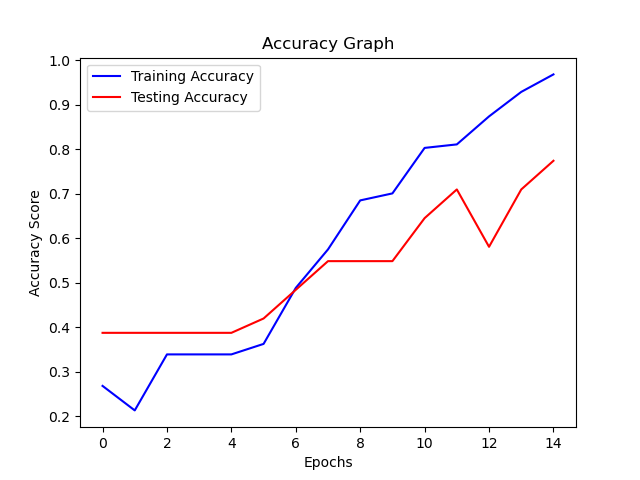
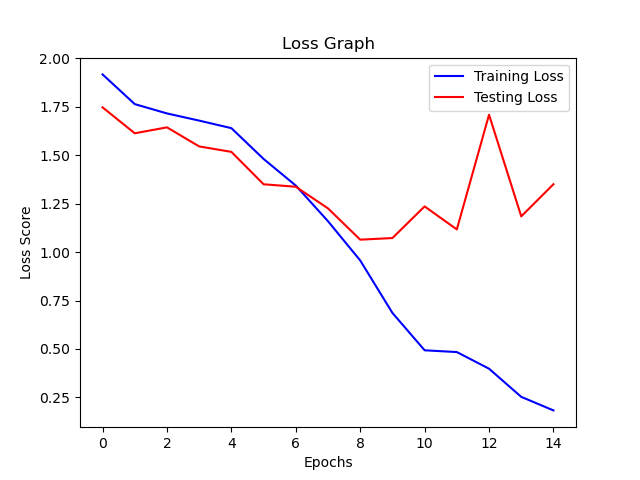

# CUMTD Bus Analysis & Classification

## Contributors:
- #### Louis Sungwoo Cho (Civil & Environmental Engineering Transportation & Computer Science Minor)
- #### Joey Junyi Cao (Aerospace Engineering)
- #### Ethan Chow (Computer Engineering)
- #### Sam Guagliardo (Civil & Environmental Engineering Transportation)
- #### Jesse Ekanya (Civil & Environmental Engineering Transportation)
- #### Saranya Yegappan (Civil & Environmental Engineering)
- #### Brandon Ma (Civil & Environmental Engineering Transportation)
- #### Brandon Tomic (Civil & Environmental Engineering Transportation)

## Project Description:
Institute of Transportation Engineers UIUC Chapter (aka ITE@UIUC) is a registered student organization at the University of Illinois at Urbana-Champaign. Our organization has been working on collecting images of transit buses operated by the Champaign-Urbana Mass Transit District (CUMTD). Our RSO Institute of Transportation Engineers UIUC Chapter (ITE@UIUC) presented our project during the 2023 Engineering Open House (EOH) hosted by the Grainger College of Engineering at the University of Illinois at Urbana-Champaign (UIUC). 

## Champaign-Urbana Mass Transit Passenger Ridership Prediction & Analysis
This project is about analyzing and predicting the ridership of the buses in the Champaign-Urbana area operated by the Champaign-Urbana Mass Transit District also known as CUMTD using various Machine Learning algorithms. Datasets were acquired from the official Champaign County Regional Data Portal which could be found here:
- #### Dataset source: [CUMTD Transit Data Ridership](https://data.ccrpc.org/da_DK/dataset/transit-ridership)

#### A 5W GREEN hopper bus approaches a bus stop shown above. 
- #### Image source: [CUMTD Bus Photos](https://yourewelcomecu.com/cumtd-bus-photos/)

Datasets from the years 1997 to 2022 and months of July, October, December and February were used to analyze and predict the passenger volume for the bus network.

The image above shows the CUMTD bus network that connects Campustown, Champaign and Urbana.
- #### Image source: [CUMTD Schedules](https://mtd.org/maps-and-schedules/maps/)

As shown in the image above, the CUMTD bus network is very dense connecting almost all the popular places visited by many passengers.

# Motivation

The Champaign-Urbana Mass Transit District also known as (CUMTD) serves as a great public transportation system throughout the entire University of Illinois at Urbana-Champaign area and a crucial type of mobility for university students to travel around on campus. You can go to Grainger Library, Campus Instructional Facility (CIF), Newmark Civil Engineering Laboratory, Thomas Siebel Center for Computer Science, Electrical & Computer Engineering Building, Sidney Lu Mechanical Engineering Building, Business Instructional Facility, Altgeld Hall, Main Library, Foellinger Auditorium and many more wonderful places by using the CUMTD buses. People even use the buses to go to downtown Champaign or to downtown Urbana to get some delicious food or to even go shopping, watch movies and even to enjoy some karaoke. As a Computational Transportation Science Student at UIUC, I decided to perform a traffic capacity analysis on the passenger ridership volume of the CUMTD buses and perform time series forecasting to estimate the predicted passenger volume in the near future.

# Seasonal Ridership Data Visualization

This section analyzes the passenger riderhip trend in four different months: October, July, February and December in addition to the total number of passengers with respect to years from 1997 to 2022. A scatter plot including all the monthls and the total bus ridership passenger analyzed from the years 1997 to 2022 were also plotted.

**Figure 1. above shows the bar chart of all the data including both months and total ridership.**

**Figure 2. above shows the scatter plot of all the data including both months and total ridership.**

**Figure 3. above shows the ridership of the CUMTD bus broken down into months.**

**Figure 4. above shows the total ridership of the CUMTD bus.**

**Figure 5. above shows the normal distribution of passengers in February.**

**Figure 6. above shows the normal distribution of passengers in July.**

**Figure 7. above shows the normal distribution of passengers in October.**

**Figure 8. above shows the normal distribution of passengers in December.**

**Figure 9. above shows the normal distribution of the total passengers.**

For most of the seasonal and the total normal distribution, the passenger distribution is heavily skewed to the left. This means that the median passenger capacity is higher than the mean value. The passenger normal distribution for July is slightly skewed to the right.

**Figure 10. above shows the seasonal pie chart.**

**Figure 11. above shows the seasonal box plot.**

Datasets were then further broken down into months and total ridership to determine the line of best fit for all the plotted data points. The following figure shows a polynomial regression of degree 5 line curve plotted with respect to the analyzed data.

**Figure 12. above shows the line of best fit for the October passenger ridership from 1997 to 2022.**

**Figure 13. above shows the line of best fit for the July passenger ridership from 1997 to 2022.**

**Figure 14. above shows the line of best fit for the February passenger ridership from 1997 to 2022.**

**Figure 15. above shows the line of best fit for the December passenger ridership from 1997 to 2022.**

**Figure 16. above shows the line of best fit for the total passenger ridership from 1997 to 2022.**

Although all the figures above called the function to perform data analysis and determine the line of best fit using the linear regression method, the data scattered shows that the trend line approximately matches the plots using the degree of 5. Thus, polynomial regression is more suitable for the analyzed dataset. According to the monthly bus ridership plots with respect to time in years, there is an increasing trend. However around the year 2020, there has been a significant drop in monthly ridership and the total ridership with respect to years due to the COVID-19 pandemic. After the pandemic, the CUMTD ridership is trending upwards.

# Machine Learning 

Several Machine Learning models were used to analyze the total passenger trend with respect to each seasonal data. Because this project is about analyzing data over a series of time, supervised models were mainly used for dataset training and testing. Linear Regression was used for dataset training and testing. A linear trend was analyzed for the Linear Regression Model to analyze the relation between predicted and actual values to show the performance of the machine learning models. 

**Figure 17. above shows Linear Regression trend for each seasonal data.**

# Time Series Forecasting

Finally, using a moving average, forecasting of the ridership of CUMTD buses was performed. After fitting the given model of passenger volume training datasets with the moving average, seasonal periods were used to forecast including previous data from 2021 to predicted passenger volume in 2030. Once the forecasting was complete, the forecasted data was plotted on the same graph as the historical data that were used to train and predict the future passenger volume. 

**Figure 18. above shows the graph of the projected passenger volume until 2030 and the historical data.**

# Conclusive Remarks

The dataset for the Champaign-Urbana Mass Transit bus passenger ridership volume from the official Champaign County Regional Data Portal was initially used to analyze the monthly ridership with respect to years to determine which month has the highest volume of passengers. The given dataset was then cleaned and parsed to perform time series forecasting to predict future passenger volume of the CUMTD buses. Time-series model was used to forecast future CUMTD passenger volumes. The historical results show that there has been a drastic drop in the year 2020 due to COVID 19 pandemic. However, after the pandemic, passenger volumes have been trending positively and is expected to fluctuate between seasons. Usually during the full school semester seasons at UIUC, passenger volumes will continuosly to be higher than seasons during summer or winter breaks. Overall, it shows that the Champaign-Urbana Mass Transit District is one of the most convenient form of travel between campuses in UIUC and to cities in Urbana and Champaign respectively.

#### A 5W bus bound for Round Barn RD waits infront of Sidney Lu Mechanical Engineering Building shown above.

# Deep Learning Model Motivation
Artificial Intelligence has wide range of applications in Transportation. Not only just Autonomous Vehicles, but also to Intelligent Transportation Systems (ITS), public transit, high-speed rail, etc. Machine Learning is commonly used for transportation dataset training and testing to make predictions in traffic capacity or classify vehicle or passenger types. Reinforcement Learning such as Markov Decision Process (MDP), Bellman Equation and Deep Q-Learning are crucial for controls. Likewise, Deep Learning for Computer Vision has many different powerful algorithms for image classification and object detection. For transportation and traffic engineers, traffic impact study is performed on major intersections or major freeways. Usually, Tuesdays, Wednesdays and Thursdays are the days when traffic capacity analysis is performed. However, having to manually count the number of vehicles on roadway segments is very difficult and time consuming. To overcome this issue, a deep learning model was created using Convolutional Neural Networks (CNN) so the overhead observer can be able to classify which type of vehicle passes in certain areas and store into a database allowing real-time traffic analysis. Through this data, macroscopic traffic parameters such as traffic flow in vehicles per hour, traffic density in vehicles per density and average space-mean speed in km/h can be calculated. For this model, the CNN classifier for buses was created. 

# Traffic Flow Theory

$$ q = k\overline{v_s} $$

$$ k = \frac{1}{s} $$

$$ q = \frac{1}{\overline{h}} $$

q is traffic flow measured in vehicles per hour, k is the traffic density measured in vehicles per kilometer, vs is the space-mean speed of the vehicles measured in km/h. These are macroscopic traffic parameters. s is the spacing measured in km and h is the headway measured in hours. These are the microscopic traffic parameters. 

# Image Preparation
Random CUMTD bus image datasets were used to train the neural network model for image classification. 158 files were then split into 8 categories.

### Random ADA images from the given image dataset.

### Random D60LF images from the given image dataset.

### Random DE40 images from the given image dataset.

### Random DE60 images from the given image dataset.

### Random MAIN images from the given image dataset.

### Random XDE40 images from the given image dataset.

### Random XDE60 images from the given image dataset.

### Random XHE60 images from the given image dataset.

Once all the random image datasets were printed out, the entire image dataset was split into training and testing sets. 80% of the total image datasets were used for training and the remaining 20% of the total image datasets were used for testing. The epochs number was set to 15 so the training model was run for 15 times. Then all the data were shuffled before the neural network model was created. 

# Convolutional Neural Network (CNN) Model
Convolutional Neural Network (CNN) model was used to classify the CUMTD bus images. One of the biggest advantage of using CNN models is that the neural network is able to detect the important features into several distinct classes from the given image datasets without any human supervision and also being much more accurate and computationally efficient. Hence, this deep learning model was chosen to train all the bus image datasets for this project. 

#### Shows how the cnn model processes the image dataset with series of convolution and pooling before flattening out the image to predict the output.

The model used for this project performs multiclass classification so the output is set to be softmax. But why is convolution so crucial in image classification? Convolution is a set of mathematical operations performed by the computer to merge two pieces of critical information from the image. A feature map for the images is produced using a 'convolution filter'. 

#### Shows how the convolution filter produces the feature map.

The convolution operation is then performed by splitting the 3 by 3 matrix into merged 3 by 3 matrix by doing an element-wise matrix multiplication and summing the total values. 

#### Shows the matrix operation of the convolution filter.

#### Shows the visualization of the  convolution input of the image.

Once all the convolution has been performed on the image datasets, pooling is then used to reduce the dimensions, a crucial step to enable reducing the number of parameters shortening the training time and preventing overfitting. Maximum pooling was used for this model which only uses the maximum value from the pooling window. 

#### Pooling of the processed image in a 2 by 2 window.

#### Pooling of the processed image in a 3 by 3 window.

Finally after adding all the convolution and pooling layers, the entire 3D tensor is flatten out to be a 1D vector into a fully connected layer to produce the output. 

#### Visual implementation of the CNN model. 

##### Original Source for the CNN Explanation: 
-  Dertat, A. (2017, November 13). Applied deep learning - part 4: Convolutional Neural Networks. Medium. Retrieved March 30, 2023, from https://towardsdatascience.com/applied-deep-learning-part-4-convolutional-neural-networks-584bc134c1e2 

# Neural Network Architecture

The Neural Network Architecture used for this project is shown above. 

# Results
Once the CNN model was built for image classification training with a given number of training steps also known as epochs set to 20, the accuracy score graph and the loss score graph with respect to each epoch step were plotted. 

#### The accuracy score of the CNN model with respect to the number of steps. 

#### The loss score of the CNN model with respect to the number of steps. 

According to the plots above, the train accuracy is very close to the testing accuracy as the number of epochs gradually increases. Overall, the model has produced a relatively high training accuracy. The number of losses meaning the error between the actual image and the predicted image decreases as more number of epochs are given into the model. This means that the chance of predicting a given image dataset accurately is very high. However, there has been an overfi

According to the plots above, the training accuracy was very close to the testing accuracy as the number of epochs gradually increased. Overall the model has produced a relatively high training and testing accuracy. However, there was overfitting of the model because the testing loss score increased towards the end. To minimize overfitting in machine learning, more datasets and the neural network architecture are expected to be investigated. 

# Prediction
Once all the image datasets have been processed and the accuracy and loss score have been analyzed, a few set of images were given into the model to determine whether the model is accurate enough predicting the bus type of a given image. Testing datasets were given into the model and the predictor plots the actual image and the predicted image with a confidence score respectively. 

#### The predicted output of each image data given into our model with the bus type and the confidence score for each image.

From the image above, it is clearly evident that the predictor estimates the bus class very accurately. The confidence is also very high for each results meaning that the results have turned out very well. Overall, the model performed very well with all the bus image datasets.
